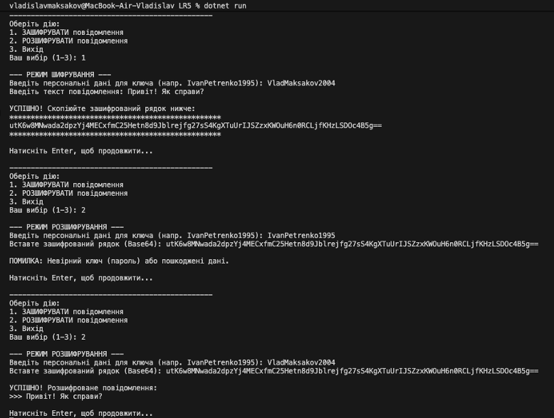

# Application_and_data_security_LR6
Консольний додаток на C# для демонстрації принципів захищеного обміну повідомленнями. Програма емулює роботу шифратора електронної пошти, використовуючи симетричне шифрування AES та генерацію ключів на основі паролів (SHA-256).

## 📋 Опис функціоналу

Програма виконує вимоги лабораторної роботи та реалізує наступні функції:
* **Генерація ключа:** Перетворення текстового пароля (персональних даних) у 256-бітний криптографічний ключ за допомогою хешування **SHA-256**.
* **Шифрування (Encryption):** Захист тексту повідомлення алгоритмом **AES** (Advanced Encryption Standard) з використанням випадкового вектора ініціалізації (IV).
* **Розшифрування (Decryption):** Відновлення початкового тексту з шифротексту при введенні правильного пароля.
* **Обмін даними:** Результат шифрування кодується в **Base64** для зручної передачі через текстові канали (email, месенджери).

## 🛠 Технології

* **Мова:** C#
* **Платформа:** .NET (Console Application)
* **Бібліотеки:** `System.Security.Cryptography`, `System.IO`, `System.Text`

## 🚀 Як запустити проект

### Варіант 1: Через Visual Studio
1. Відкрийте файл рішення `CryptoLab.sln` або `LR5.sln`.
2. Натисніть кнопку **Start** або клавішу `F5`.

### Варіант 2: Через термінал (Command Line)
Переконайтеся, що у вас встановлено .NET SDK.
1. Відкрийте термінал у папці з проектом.
2. Запустіть програму командою:
dotnet run

## 📖 Інструкція з використання

1. **Запуск:** Після запуску відкриється головне меню.
2. **Шифрування:**
   - Оберіть пункт `1`.
   - Введіть **пароль-ключ** (наприклад: `IvanPetrenko1995`).
   - Введіть **текст повідомлення**.
   - Скопіюйте отриманий `Base64` рядок (шифротекст).
3. **Розшифрування:**
   - Оберіть пункт `2`.
   - Введіть **той самий пароль**, що використовувався при шифруванні.
   - Вставте скопійований `Base64` рядок.
   - Отримайте розшифроване повідомлення.

---

## 📸 Скріншот результатів роботи

